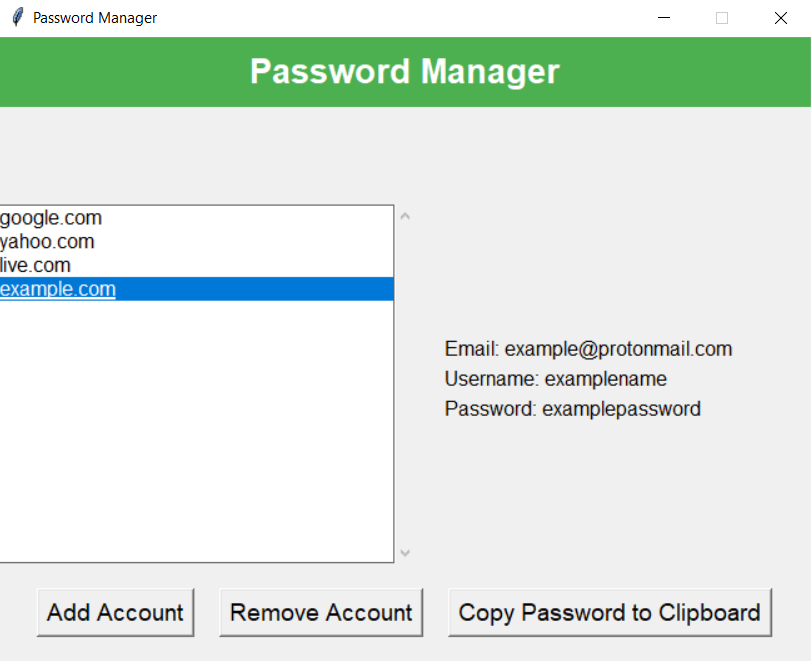

# Not encrypted password manager


Not encrypted password manager is a Python-based tool designed for saving your passwords, emails and usernames with application into editable file without extension with small amount of encryption.

The project icon above taken from https://www.flaticon.com and edited.

## Screenshots



## Features

- Very simple to use.
- You can save any password, from any website, counting email and username.
- No apis or any other connections with web, means your passwords stored on your computer only.
- You can copy password to clipboard by selecting account and clicking copy password to clipboard text at bottom.

## Cons

- Lack of password encryption.
- Insufficient password protection.
- No two-factor authentication.
- Unhandled exceptions.
- Lack of access protection mechanism.
- Lack of session management.
- Simple password hashing.

## Discord


Discord: @intosins
  
## Usage

The not encrypted password manager is designed to run on Windows 10, Windows 8, and Windows 7 operating systems. And may not work on other OS (like Linux).

Please note that you should have Python 3 installed on your system to run the tool successfully. The script was coded using Python version 3.11.5.

Just download manager.py and run it in VS studio code to use password manager.

```bash
1. Install the required dependencies:

pip install tkinter hashlib pyperclip

pip install tkinter
pip install hashlib
pip install pyperclip

2. Clone the repository:
git clone https://github.com/intosins/not-encrypted-password-manager.git
cd not-encrypted-password-manager
